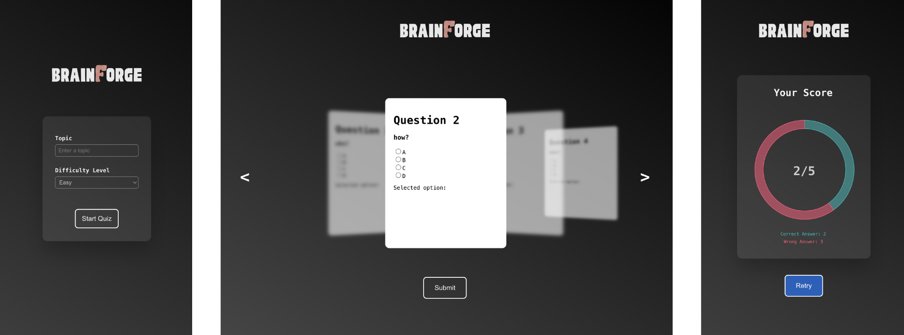

# BrainForge

A versatile quiz application designed to adapt to any topic of your choice. Select your preferred difficulty level easy-medium-hard and engage with AI powered questions tailored to challenge and educate.


&nbsp;
&nbsp;
&nbsp;
&nbsp;

## Table of contents
- [General info](#general-info)
- [Design](#design)
- [Technologies](#technologies)
- [Setup](#setup)

## General info
A quiz game, created with React. Based on topic input and chosen difficulty 5 questions are generated, with 4 options to choose for an answer. implemented swipeable 3d slider using inline styles in js, form handling in React, applied props passing and state manipulation.
<br>

Link to the website: <a href="https://alanbaltabay-react-quiz.netlify.app">link</a> <br>
Questions are taken from: <a href="https://openai.com/index/openai-api/">OpenAi</a>

## Design


## Technologies
- JavaScript (fetch API) 
- React (useState and useEffect hooks, state, props, handlers)
- Chart.js (donut chart for score depiction)

## Setup
To run this project (after downloading and installing the packages):
```
$ npm run dev
```
Required packages installation:
```
$ npm install react-router-dom
$ npm install react-swipeable
$ npm install chart.js react-chartjs-2

```